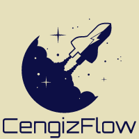

# Training with Metaflow

<p align="center">
  
</p>

**Abstract:** This project includes parallel training pipeline with [Metaflow]() based on gender classification problem. The focus is on practicing the tools used, not the problem that model solves.

# Installation
## Dataset
CelebAHQ dataset was used for training and WIKI dataset was used for validation. Processed images can be downloaded from [here](https://drive.google.com/file/d/1karOtT_tB34SW8I-dcQZ-vGR5NKMJqxY/view?usp=sharing) then unzip file to [src/Data](src/Data)
```
CelebAHQ: 30000 images
WIKI: 38455 images
```
## Configs
All training and hyperparameter tuning parameters can be changed from the [train.py](train.py) file. Descriptions of all parameters are available in the file.
## Environment
### Anaconda
```
conda create --name meta python==3.7.13
conda activate meta
pip install -r requirements.txt

# For Cuda 11.1
pip install torch==1.10.1+cu111 torchvision==0.11.2+cu111 -f https://download.pytorch.org/whl/torch_stable.html

# For Cuda 10.2
pip install torch==1.10.1+cu102 torchvision==0.11.2+cu102 -f https://download.pytorch.org/whl/torch_stable.html

python train.py run
```
### Docker
```
docker build -t meta .
docker run --runtime=nvidia -it meta train.py run
```